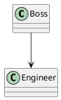
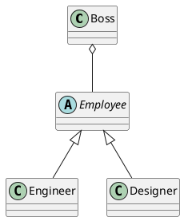

# SOLID 之 依賴反轉原則（Dependency inversion principle）

原文：

> * High-level modules should not depend on low-level modules. Both should depend on abstractions.  
> * Abstractions should not depend on details. Details should depend on abstractions.

直譯：

* 高層模組不應該依賴底層模組，它們都應該依賴抽象。
* 抽象不應該依賴細節。細節應該依賴抽象。

會稱之為依賴反轉，是因為我們習慣上是由高層模組直接依賴底層模組，比方說：某某血汗企業的慣老闆（Boss）不會寫 code ，所以他需要依賴一群工程師（Engineer）幫助寫程式實作需求，這個關係實作如下：

```php
<?php

class Boss
{
    private $employees = [];
    private $demand = [];

    public function recruit($newEmployee)
    {
        print "歡迎新員工 {$newEmployee->name} 來到我們血汗企業\n";
        $this->employees[] = $newEmployee;
    }

    public function addDemand($demand)
    {
        print "新需求「{$demand}」麻煩一定要先做\n";
        $this->demand[] = $demand;
    }

    public function startSprint()
    {
        foreach ($this->demand as $demand) {
            $randKey = array_rand($this->employees);
            $this->employees[$randKey]->code($demand);
        }
    }
}

class Engineer
{
    public $name;
    public function __construct($name)
    {
        $this->name = $name;
    }

    public function code($demand)
    {
        print "{$this->name} 很不願地實作需求 {$demand} ...\n";
    }
}

$boss = new Boss();
$boss->recruit(new Engineer('Miles'));
$boss->recruit(new Engineer('阿貓'));
$boss->recruit(new Engineer('阿狗'));

$boss->addDemand('行距太大，調小一點');
$boss->addDemand('圖片麻煩置中');
$boss->addDemand('這段文字刪掉，念起來比較通順');
$boss->addDemand('這個很簡單，下班前給我');
$boss->addDemand('你就先做一個來看看吧');

$boss->startSprint();
```

跑起來的結果如下：

```
歡迎新員工 Miles 來到我們血汗企業
歡迎新員工 阿貓 來到我們血汗企業
歡迎新員工 阿狗 來到我們血汗企業
新需求「行距太大，調小一點」麻煩一定要先做
新需求「圖片麻煩置中」麻煩一定要先做
新需求「這段文字刪掉，念起來比較通順」麻煩一定要先做
新需求「這個很簡單，下班前給我」麻煩一定要先做
新需求「你就先做一個來看看吧」麻煩一定要先做
阿貓 很不願地實作需求 行距太大，調小一點 ...
Miles 很不願地實作需求 圖片麻煩置中 ...
阿狗 很不願地實作需求 這段文字刪掉，念起來比較通順 ...
阿貓 很不願地實作需求 這個很簡單，下班前給我 ...
阿貓 很不願地實作需求 你就先做一個來看看吧 ...
```

程式的依賴關係如下：


PlantUML 源碼



## 問題

這段程式碼是標準上層模組依賴下層模組，老闆請員工做事，乍看之下蠻合理的。

但是，工程師做出來的東西都沒有美感，老闆想請一個設計師幫忙美化產品，設計師表示：

```php
<?php

class Designer
{
    public $name;
    public function __construct($name)
    {
        $this->name = $name;
    }

    public function code($demand)
    {
        throw new Exception('扣丁西蝦米？');
    }
}
```

結論：因為設計師不會寫扣，違反了[里氏替換原則][Day 9]，所以無條件免除了進血汗企業的命運。但這個結論慣老闆肯定不開心，那該怎麼辦呢？

## 解法

首先，慣老闆要先改變想法：員工如果有充足的休息時間與適當的薪水，自然會馬力全開地工作，因此要先開出像下面這樣的合約（介面）：

```php
<?php

abstract class Employee
{
    private $name;
    
    public function __construct($name)
    {
        $this->name = $name;
    }
    
    abstract public function fullRelax();
    abstract public function pay($properSalary);
    abstract public function workHard($demand);
}
```

這樣不管是工程師或是設計師，都會願意成為員工（實作），為公司努力工作：

```php
<?php

class Engineer extends Employee
{
    public function fullRelax()
    {
        print "{$this->name} 休息中，請稍候 ...\n";
    }

    public function pay($properSalary)
    {
        print "{$this->name} 感謝老闆的薪資 {$properSalary} ，未來繼續一起努力！\n";        
    }

    public function workHard($demand)
    {
        print "{$this->name} 努力實作需求 {$demand} ...\n";        
    }
}

class Designer extends Employee
{
    public function fullRelax()
    {
        print "{$this->name} 休息中，請稍候 ...\n";
    }

    public function pay($properSalary)
    {
        print "{$this->name} 感謝老闆的薪資 {$properSalary} ，未來繼續一起努力！\n";
    }

    public function workHard($demand)
    {
        print "{$this->name} 努力設計需求 {$demand} ...\n";
    }
}
```

當然說到要做到，老闆的實作如下：

```php
<?php

class Boss
{
    private $employees = [];
    private $demand = [];

    public function recruit(Employee $newEmployee)
    {
        print "歡迎新員工 {$newEmployee->name} 來到我們大家庭\n";
        $this->employees[] = $newEmployee;
    }

    public function addDemand($demand)
    {
        print "新需求「{$demand}」麻煩你\n";
        $this->demand[] = $demand;
    }

    public function startSprint()
    {
        // 衝刺前先養好身體
        foreach ($this->employees as $employee) {
            $employee->fullRelax();           
        }
        
        // 衝刺，把這一票需求做完就行了
        foreach ($this->demand as $demand) {
            $randKey = array_rand($this->employees);
            $this->employees[$randKey]->code($demand);
        }
        
        // 衝刺後，辛苦大家了
        foreach ($this->employees as $employee) {
            $employee->pay(220000);           
        }
    }
}

$boss = new Boss();
$boss->recruit(new Engineer('Miles'));
$boss->recruit(new Engineer('阿貓'));
$boss->recruit(new Engineer('阿狗'));
$boss->recruit(new Designer('美美'));

$boss->addDemand('購物車功能，規格詳細文件如附檔');
$boss->addDemand('登入留言功能，要能商品下留言');
$boss->addDemand('這個需求不知道難不難，要麻煩你做了');
$boss->addDemand('需求目前是這樣，文件不夠請跟我說');

$boss->startSprint();
```

```
歡迎新員工 Miles 來到我們大家庭
歡迎新員工 阿貓 來到我們大家庭
歡迎新員工 阿狗 來到我們大家庭
歡迎新員工 美美 來到我們大家庭
新需求「購物車功能，規格詳細文件如附檔」麻煩你
新需求「登入留言功能，要能商品下留言」麻煩你
新需求「這個需求不知道難不難，要麻煩你做了」麻煩你
新需求「需求目前是這樣，文件不夠請跟我說」麻煩你
Miles 休息中，請稍候 ...
阿貓 休息中，請稍候 ...
阿狗 休息中，請稍候 ...
美美 休息中，請稍候 ...
美美 努力設計需求 購物車功能，規格詳細文件如附檔 ...
阿狗 努力實作需求 登入留言功能，要能商品下留言 ...
阿狗 努力實作需求 這個需求不知道難不難，要麻煩你做了 ...
Miles 努力實作需求 需求目前是這樣，文件不夠請跟我說 ...
Miles 感謝老闆的薪資 220000 ，未來繼續一起努力！
阿貓 感謝老闆的薪資 220000 ，未來繼續一起努力！
阿狗 感謝老闆的薪資 220000 ，未來繼續一起努力！
美美 感謝老闆的薪資 220000 ，未來繼續一起努力！
```

程式的依賴關係如下：


PlantUML 源碼



今天如果有測試人員想加入團隊，當然可以，只要願意「充足的休息」、「認真的工作」、「適當的薪水」，就能加入這個團隊：

```php
<?php

class Tester extends Employee
{
    public function fullRelax()
    {
        print "{$this->name} 休息中，請稍候 ...\n";
    }

    public function pay($properSalary)
    {
        print "{$this->name} 感謝老闆的薪資 {$properSalary} ，未來繼續一起努力！\n";        
    }

    public function workHard($demand)
    {
        print "{$this->name} 努力測試功能 {$demand} ...\n";        
    }
}

$boss = new Boss();
$boss->recruit(new Tester('測測'));
```

## 結果

原本慣老闆直接依賴工程師（依賴細節），所以只有工程師才能幫他；改變想法之後，變成依賴肯拿肯做的員工（依賴抽象），不管是設計師或是測試，只要肯拿肯做（細節依賴抽象），都能加入老闆的團隊。

軟體上的應用像是：原本 PHP 要操作 MySQL ，需要呼叫 `mysql_*` 系列的 function ，但在換底層模組時，比方說要換資料庫，就得把所有相關的 function 全換掉，非常痛苦。使用 PDO 則是呼叫它提供的抽象方法如 `exec()` ，不同的資料庫都一樣用 `exec()` 方法來執行 SQL 語法，轉換資料庫只要轉換背後所接的 Driver 即可，簡單非常多。

> Teddy ：「避免上層模組因為底層模組改變而被迫改變」－－ [SOLID：五則皆變][]

這就是依賴反轉原則。

## 參考資料

* [SOLID：五則皆變][]
* [里氏替換原則][Day 9]

[SOLID：五則皆變]: http://teddy-chen-tw.blogspot.tw/2014/04/solid.html
[Day 9]: /docs/day09.md
